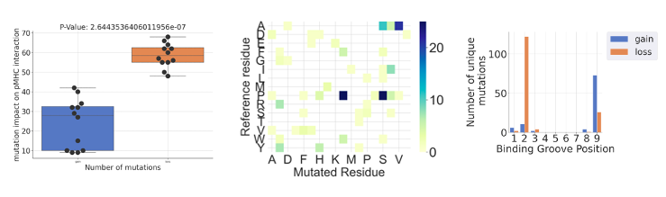
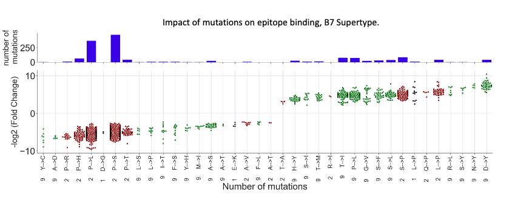

# CoVescape pipeline

## General information

This suite was developped to determine the impact of SARS-CoV-2 mutations on CD8+ epitope presentation. Taking in a list of SARS-CoV-2 mutations, this suite is composed of several scripts that will:
-	Generate mutated and corresponding unmutated ‘short sequencing windows’ (mutation position +/- 14 residues) around each unique mutation
-	Generate all possible mutated/nonmutated peptide pairs using netMHCpan 4.1 EL
-	Perform statistics and generate a variety of figures to facilitate the interpretation of data outputs.

The script CoVescape.sh was developed to assist users in maneuvering through the various scripts making up this pipeline. To utilize CoVescape, download the 'scripts' folder. This folder contains a connitation of python and bash scripts as well as data folders corresponding to each component of the pipeline. The user should then download the CoVescape.sh bash shell script and place it inside the working directory. 
Note: It essential to open the CoVescape.sh script in the editor of your choice, and to modify the second line ($FOLDER). The user should replace the path currently inplace with the full path to the folder containing the 'scripts' folder (mentioned above). 

This pipeline requires the python packages indicated below, as well as netMHCpan 4.1. The later should be downloaded separately. The user will be required to provide the path to the netMHCpan shell script in order to run the RunNetMHCpan.sh command.

For details regarding the inputs required by each command, type " ./CoVescape.sh --help " while in the same directory as the CoVescape.sh file.

#### External dependencies:
-	pandas 
-	seaborn & matplotlib
-	matplotlib_venn
-	numpy
-	math
-	multiprocessing
-	Biopython

#### Other tools to download:
-	netMHCpan 4.1

## Instructions:
### RunNetMHCpan.sh

Create a folder called runnetMHCpan (name is trivial), copy the CoVescape.sh as well as the mutation mutation file in it. To run RunNetMHCpan.sh method:

Inputs: 
-	Raw mutation list (tab delimited)
-	List of HLA molecules to query (must be in the following format: 
o	HLA-A02:01,HLA-A03:01,HLA-B07:02….
-	Path to folder where results will be saved
-	Path to netMHpan file

Suggested command: 
./CoVescape.sh --script RunNetMHCpan.sh -r myMutations.txt --HLAlist HLA-A01:01,HLA-A02:01 --OutputFilePATH Path/to/workspace/RESULTS --netMHCpanPATH Path/to/netMHCpan

Copy the files named ‘MutFrequency_NUC.csv’ and ‘netMHCpanOUTPUT.csv’ files outputted into the RESULTS folder, as well as the CoVescape.sh into a separate folder called postnetMHC (again, name is trivial), which will be used to run the PostnetMHC.sh method.

### PostnetMHC.sh

Inputs:
-	netMHCpan raw output (netMHCpanOUTPUT.csv)
-	processed/reformatted mutation list (mutFrequency_NUC.csv)

suggested command: 
./CoVescape.sh --script PostnetMHC.sh --NetMHCOutput netMHCpanOUTPUT.csv --MutationList _MutFrequency_NUC.csv

This command will create a folder named netMHCpanOUTPUT_DataOutput. This folder contains HLA-specific processed netMHCpan outputs files (.csv), as well as a txt file contain all the names said .csv files. The contents of this folder must be copied (along with the CoVescape.sh file and the netMHCpanOUTPUT.csv file) into a third folder called GetCores (name is trivial). Once in this folder, the GetCores.sh method can be run.

### GetCores.sh

Inputs:
-	netMCHpanOUTPUT.csv  (same as above)
-	txt file with names of all HLA-specific processed netMCHpan data (along with said files)

suggested command:
./CoVescape.sh --script GetCores.sh --NetMHCOutput netMHCpanOUTPUT.csv --tempFrame netMHCpanOUTPUT_TempFrame.txt

This method will generate a folder named netMHCpanOUTPUT_withCore, containing HLA specific processed netMHCpan files (finishing with ‘withCore’) as well as a text file containing the names of said files. Once again, the contents of this folder (long with the CoVescape.sh script) can be copied into another folder. In this folder, the method PetersFigure.sh can be run.

Example figures from GetCore.sh:

### PetersFigure.sh

Inputs:
-	txt file with names of HLA-specific netMHCpan processed files, along with said files.

This method will generate FC, p-values, as well as heatmaps for mutations categorized by the reference residue, the mutated residue, as well as the entire transition (X->Y) for the various mutations of interest. One particularly important figure here is called ‘boxplot’. It will plot all mutated/reference peptide pairs passing a certain p-value and FC cutoff. This method is most informative when performed on a set of HLA types belonging to a single HLA Supertype.

Example figure (boxplot.png) from PetersFigure.sh:

